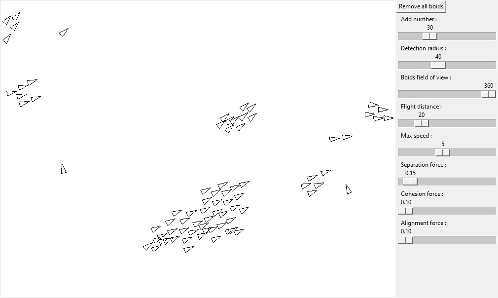

# Python-Flocking-Simulation

This is a reproduction of a program created in 1986 by Craig W. Reynolds. This program simulates the behavior of a flock of birds.

The boids have 3 rules :
- get closer to its furthest neighbors
- move away from nearest neighbors
- follow its neighbors
## Features
- Visual simulation result
- Possibility to ajust simulation settings
## Installation
1. Download the repository by clicking on `Code > Download ZIP`
2. Extract the ZIP file
3. Run `main.pyw`
## Requirements
- Python 3.7
- Python tkinter library
- Python math library
- Python time library
## Usage
In the right section you can ajust the simulation settings.

To add boids you have to click on the visual section with `LEFT` mouse button

The detection radius corresponds to how far an other boid is considered as a neighbor.

Flight distance is the distance the boids will try to keep between them.

Max speed is the maximum flight speed of the boids.

The three last settings correspond to the force applying to each flight rule.